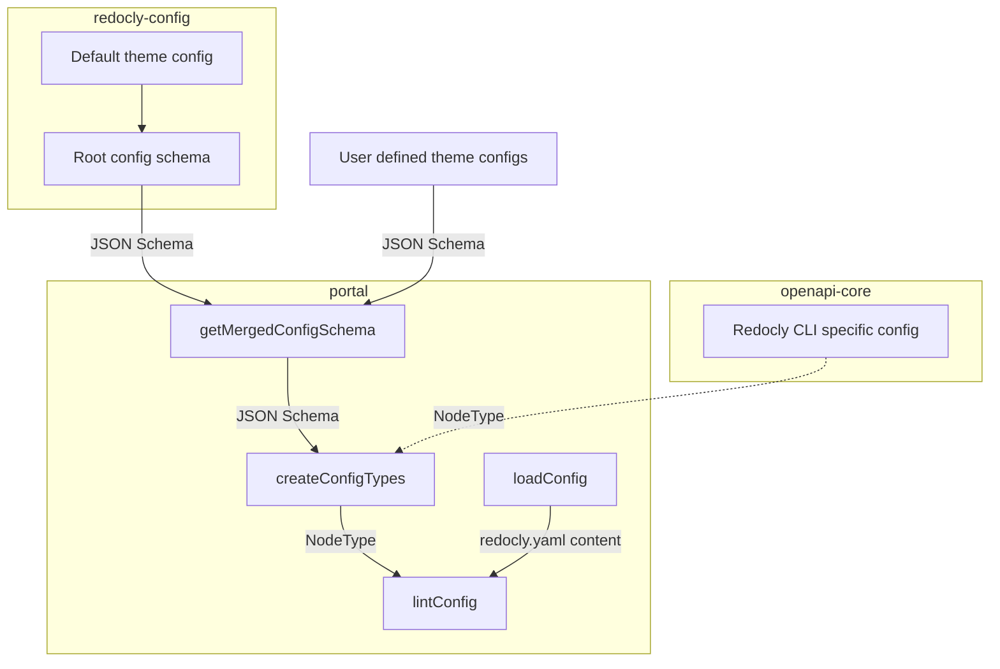

# Redocly config schema

This package contains the JSON schema for the Redocly configuration file.
It consists of two main parts: [the root config schema](./src/root-config-schema.ts) and [the default theme config schema](./src/default-theme-config-schema.ts).

Also, it contains some [shared constants](./src/constants.ts) and types.

## Architecture

High-level config resolution and validation process is described in the diagram below:

We use JSON Schema to define the structure of the configuration file inside the monorepo and for user-defined theme configs.
On the other hand, `@redocly/openapi-core` uses its internal `NodeType` to gain better linting output.
They are getting merged inside the `createConfigTypes` function and then the actual config (resolved by `loadConfig`) gets linted by the `lintConfig` function.

## Usage

Please import types and constants from this package everywhere in the monorepo where you need to work with anything related to the Redocly config.
